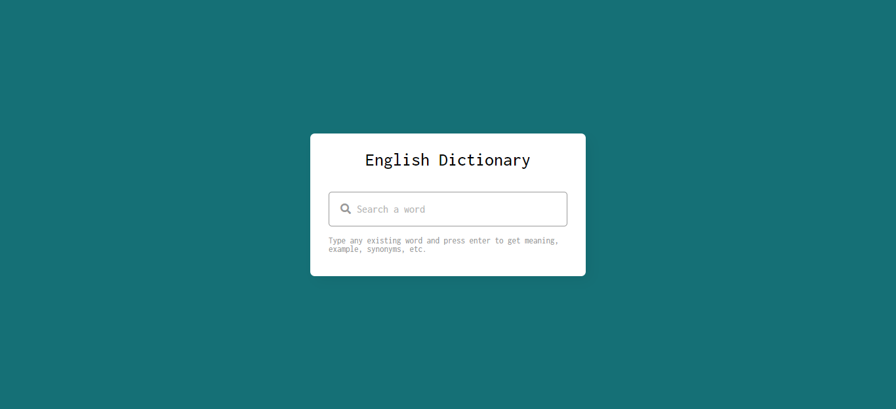

# English Dictionary using JavaScript

This is an [English Dictionary.](https://www.figma.com/community/file/1119570033612610010).

## Table of contents

- [Overview](#overview)
  - [Screenshot](#screenshot)
  - [Links](#links)
  - [Built with](#built-with)
- [Author](#author)

## Overview

The challenge is to build out this English Dictionary using JavaScript that can give the user any word definitions and turns text to speach.

### Screenshot

### Links

- Live Site URL: [live site](https://englishdictionary1.netlify.app)

### Built with

- JavaScript
- [Free Dictionary API](https://dictionaryapi.dev/)
- html
- Css

## Author

- builded by - [@mohamed-benoughidene](https://github.com/mohamed-benoughidene)
